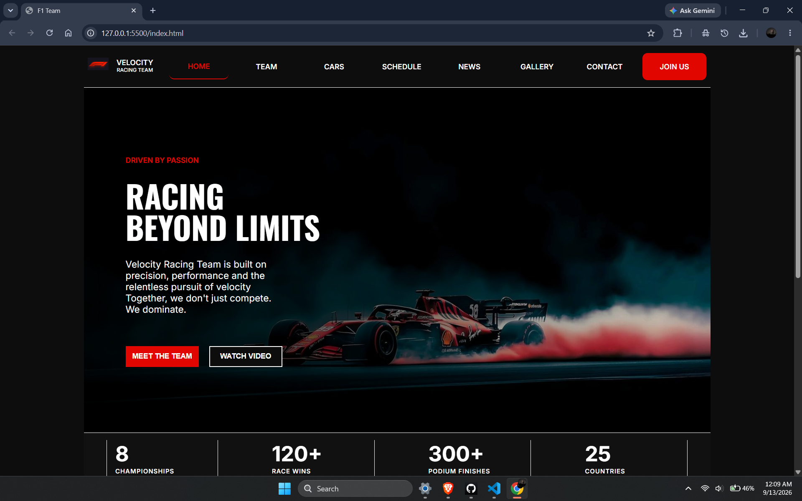
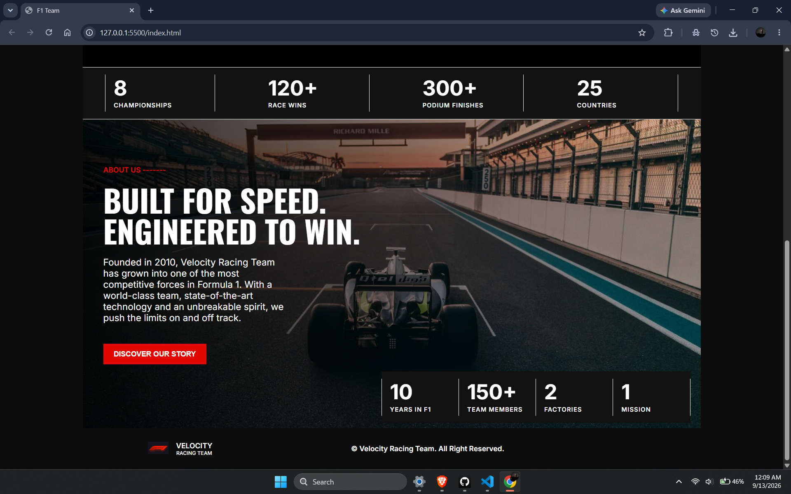

Velocity Racing Team :

A Formula 1-inspired racing team landing page built using HTML and CSS.

About the Project :

Velocity Racing Team is a basic frontend web development project designed around the theme of Formula 1 racing. It features a dark, racing-inspired visual design with red accents, bold typography, and background imagery.

The website presents a fictional racing team's identity, achievements, and mission through a simple landing page layout.

Features :

Navigation bar with Home, Team, Cars, Schedule, News, Gallery, Contact, and Join Us.

Hero section with racing-themed headings and call-to-action buttons.

Team statistics section featuring championships, race wins, podium finishes, and countries.

About Us section describing the team's vision and racing identity.

Additional team statistics, including years in F1, team members, factories, and mission.

Footer with team branding and copyright information.

Hover effects on navigation links and buttons.

Basic media queries for smaller screen sizes.

Technologies Used :

HTML5

CSS3

Google Fonts — Inter and Oswald

Project Structure :

F1-Team/
│
├── index.html
├── style.css
├── images/
│   ├── f1-logo.jpg
│   ├── hero-img.jpg
│   └── 2nd-image.jpg
│
└── README.md

How to Run :

Clone the repository: git clone https://github.com/Satyam-Raja-616/f1-team.git

Open the project folder in VS Code.

Open index.html in your browser, or use the Live Server extension.

Responsiveness :

The website includes basic CSS media queries for different screen sizes. However, it is a beginner-level project and is not fully optimized for all devices.

Learning Objectives :

Practice HTML webpage structure.

Improve CSS styling and layout skills.

Learn to use background images and custom fonts.

Understand basic responsive design techniques.

Build a visually appealing frontend landing page.

Website Preview :

Homepage — Top Section :

Homepage — Bottom Section :

Author :

Satyam Raja

GitHub: https://github.com/Satyam-Raja-616

License :

This project was created for educational and portfolio purposes.